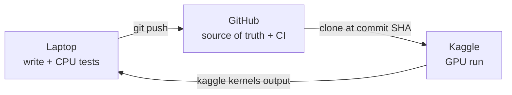

# SpecAdapt — Dev Workflow Setup

2026-09-19 · @Someone

## TL;DR

You write and test on the laptop with uv, push to GitHub, and Kaggle runs one pinned commit on a GPU, then hands back a results file.



- **One-way dependency.** The Kaggle runner depends on the library. The library never mentions Kaggle.
- **One command, two sizes.** `python -m specadapt.bench --config <file>` runs small models on CPU locally and real models on GPU on Kaggle. Only the config changes.
- **Every result carries its commit SHA and config**, so any number traces back to the exact code that produced it.
- **Windows-friendly.** All dev tasks live in one plain-Python script, `tools/dev.py`, run through uv. No make, sed or bash needed.
- **Daily loop:** `uv run tools/dev.py test` → `git push` (CI goes green) → `uv run tools/dev.py kaggle --config ...` → `uv run tools/dev.py fetch`.

## Guide 1 — Library on the laptop

Goal: a uv-managed package that installs CPU-only torch locally, runs the full test suite in under a minute, and exposes one bench command.

**Step 1. Create the project.** `uv init --lib` gives you the `src/` layout and a `pyproject.toml`.

```powershell
uv init --lib specadapt
cd specadapt
uv python pin 3.11   # match Kaggle's Python; check there with `python --version`
mkdir src/specadapt/bridge, src/specadapt/logits, src/specadapt/kpolicy, src/specadapt/bench, tests, configs, kaggle, tools, runs
```

**Step 2. Add dependencies with loose lower bounds.** Kaggle already has CUDA builds of torch and transformers installed. Loose bounds let pip keep those instead of downloading new ones on every run.

```bash
uv add "torch>=2.1" "transformers>=4.45" "accelerate" "pyyaml"
uv add --dev pytest ruff
```

**Step 3. Pin torch to the CPU build.** On Windows the default torch is already CPU-only, but GitHub's Linux runners would pull the multi-GB CUDA wheel. This setting keeps every machine you control on the small CPU build. It lives under `[tool.uv]`, so it never affects the published package or Kaggle. Add to `pyproject.toml`:

```toml
[[tool.uv.index]]
name = "pytorch-cpu"
url = "https://download.pytorch.org/whl/cpu"
explicit = true

[tool.uv.sources]
torch = [{ index = "pytorch-cpu" }]

[tool.pytest.ini_options]
markers = [
  "tokenizer: downloads real tokenizers (network, no weights)",
  "model: runs small real or random models on CPU",
]
```

Then run `uv sync` and check with `uv run python -c "import torch; print(torch.__version__)"`. The version should end in `+cpu`.

**Step 4. Build the bench entry point first, before any module.** Create `src/specadapt/bench/__main__.py` so `python -m specadapt.bench --config X --out DIR` works. It should:

1. Load the YAML config (draft model, target model, dataset, K, which modules are on).
2. Pick the device automatically: `cuda` if available, else `cpu`.
3. Write `DIR/results.jsonl`. The first line is a meta record (config, `SPECADAPT_SHA` env var, device name, timestamp). Then one line per prompt.
4. Skip prompts already present in the file, so a killed run resumes where it stopped.

In week 1 it just runs vanilla speculative decoding. M1, M2 and M3 plug in later as config switches.

**Step 5. Write two starter configs.**

| Config | Draft | Target | Runs on | Purpose |
| --- | --- | --- | --- | --- |
| `configs/smoke_cpu.yaml` | `JackFram/llama-68m` | `HuggingFaceTB/SmolLM2-135M` | Laptop CPU | Real cross-tokenizer pair, 5 prompts, end-to-end check |
| `configs/t4_smol_qwen7b.yaml` | `HuggingFaceTB/SmolLM2-135M` | `Qwen/Qwen2.5-7B-Instruct` (4-bit) | Kaggle T4 | First real baseline number |

**Step 6. Write tests in three layers.** Plain `uv run pytest` runs everything; `-m "not model"` skips the slowest layer.

1. **Logic, no model** (unmarked): trie insert and lookup, LFU eviction, entropy threshold, and acceptance α = Σ min(p, q) on hand-made distributions. Milliseconds.
2. **Real tokenizers** (`@pytest.mark.tokenizer`): load only the tokenizers of `JackFram/llama-68m` and `Qwen/Qwen2.5-0.5B`, both ungated. Test the vocabulary overlap and the "f | la | ke → flake" merge.
3. **Small models** (`@pytest.mark.model`): the full draft → adapter → verify loop with `hf-internal-testing` tiny random models (confirm exact names on the Hub), plus one run of `smoke_cpu.yaml`. Catches shape, dtype and device bugs before spending GPU quota.

**Step 7. Add a task script, tools/dev.py,** so the daily commands are short and visible. Make, sed and chmod don't exist on Windows 10, so the tasks are plain Python using only the standard library. It behaves the same on the ThinkPad and in CI. Guide 3 adds the Kaggle tasks.

```python
"""Dev tasks. Usage: uv run tools/dev.py <task> [--config PATH]"""
import argparse, datetime, pathlib, shutil, subprocess, sys

ROOT = pathlib.Path(__file__).resolve().parents[1]
TASKS = {}

def task(fn):
    TASKS[fn.__name__.replace("_", "-")] = fn
    return fn

def sh(*cmd, capture=False):
    print("$", " ".join(cmd), flush=True)
    r = subprocess.run(cmd, cwd=ROOT, check=True, text=True, capture_output=capture)
    return r.stdout.strip() if capture else None

@task
def test(a):
    sh("uv", "run", "ruff", "check", "src", "tests")
    sh("uv", "run", "pytest", "-m", "not model")

@task
def test_all(a):
    sh("uv", "run", "pytest")

@task
def smoke(a):
    sh("uv", "run", "python", "-m", "specadapt.bench",
       "--config", "configs/smoke_cpu.yaml", "--out", "runs/smoke")

# Guide 3, Step 5: paste the Kaggle tasks here.

if __name__ == "__main__":
    p = argparse.ArgumentParser()
    p.add_argument("task", choices=TASKS)
    p.add_argument("--config")
    a = p.parse_args()
    TASKS[a.task](a)
```

Run tasks as `uv run tools/dev.py test`, `uv run tools/dev.py test-all` or `uv run tools/dev.py smoke`. Every command it runs is printed first with a `$`, so you always see exactly what happened.

**Step 8. Ignore local artefacts and fix line endings.** Add `runs/`, `kaggle/_build/` and `.venv/` to `.gitignore`. Commit `uv.lock`: it records the exact versions you tested with. Add a `.gitattributes` file containing the single line `* text=auto eol=lf`, so files reach GitHub and Kaggle with Linux line endings even though you edit on Windows. If Hugging Face warns about symlinks while downloading, it is harmless on Windows; silence it once with `setx HF_HUB_DISABLE_SYMLINKS_WARNING 1`.

**Done when:** `uv run tools/dev.py test` passes and `uv run tools/dev.py smoke` writes `runs/smoke/results.jsonl` on the ThinkPad.

## Guide 2 — GitHub and CI

Goal: a public repo where every push is tested automatically, so only green commits ever reach Kaggle.

**Step 1. Create the repo public from day one.** Kaggle can then clone it without any token. Install Git for Windows first if you don't have it. Add an Apache-2.0 `LICENSE` and a short `README.md` (what it is, `uv sync`, `uv run tools/dev.py test`). The commands below are one per line because Windows PowerShell 5.1, the Windows 10 default, doesn't support `&&`.

```powershell
git init
git add .
git commit -m "skeleton: bench entry point + test layers"
git branch -M main
git remote add origin https://github.com/<you>/specadapt.git
git push -u origin main
```

If you prefer to keep it private until release, Kaggle needs a GitHub token stored in Kaggle Secrets to clone it. That adds one moving part, so public is simpler.

**Step 2. Add the CI workflow** at `.github/workflows/tests.yml`. It runs layers 1 and 2 on every push, on both Linux (like Kaggle) and Windows (like your ThinkPad), through the same `tools/dev.py test` you run locally. Downloaded tokenizers are cached between runs.

```yaml
name: tests
on: [push, pull_request]
jobs:
  test:
    strategy:
      matrix:
        os: [ubuntu-latest, windows-latest]
    runs-on: ${{ matrix.os }}
    steps:
      - uses: actions/checkout@v4
      - uses: astral-sh/setup-uv@v6
      - uses: actions/cache@v4
        with:
          path: ~/.cache/huggingface
          key: hf-${{ matrix.os }}-${{ hashFiles('tests/**') }}
      - run: uv sync --locked
      - run: uv run tools/dev.py test
```

`--locked` makes CI fail if `uv.lock` is out of date, so CI always tests the exact versions you tested locally. Use only ungated models in tests, since CI has no Hugging Face token.

**Step 3. Keep three simple conventions.**

- **`main` is always green.** Try risky ideas on a branch (`m2-lowrank-head`), merge when CI passes.
- **Experiments point at a commit SHA, not a branch.** A branch moves; a SHA never does, so the number stays traceable.
- **Tag milestones** that match the proposal's plan: `git tag tier0-v0.1 && git push --tags`. Each tag marks a reproducible state for the report.

**Done when:** a push shows a green check on GitHub within a few minutes.

## Guide 3 — Kaggle runner

Goal: one terminal command sends a pushed commit plus a config to a Kaggle GPU, and a second command brings the results back. No clicking in the browser after the first setup.

**Step 1. One-time account setup.**

1. Verify your phone number in Kaggle settings. Without it, GPU and Internet stay locked.
2. In Kaggle Settings → API, create a new token. Save the downloaded `kaggle.json` as `C:\Users\<you>\.kaggle\kaggle.json` (create the `.kaggle` folder if needed).
3. Test the CLI with `uvx kaggle kernels list --mine`. `uvx` runs it without adding it to your project.

**Step 2. Add a GPU extra to the library.** 4-bit targets need `bitsandbytes`, which you don't want on the laptop. Run `uv add --optional gpu bitsandbytes`; Kaggle installs it with `specadapt[gpu]`.

**Step 3. Write `kaggle/kernel-metadata.json`.** `__USER__` is filled in by the task script.

```json
{
  "id": "__USER__/specadapt-runner",
  "title": "specadapt-runner",
  "code_file": "run.py",
  "language": "python",
  "kernel_type": "script",
  "is_private": true,
  "enable_gpu": true,
  "enable_internet": true,
  "dataset_sources": [],
  "kernel_sources": [],
  "competition_sources": [],
  "model_sources": []
}
```

**Step 4. Write the template `kaggle/run.py`.** It is deliberately dumb: clone one commit, install it, run the bench. All real logic stays in the library. The clone goes to `/tmp` so only results land in the output folder.

```python
import os, subprocess, sys

REPO = "https://github.com/<you>/specadapt.git"
SHA = "__SHA__"        # filled in by `tools/dev.py kaggle`
CONFIG = "__CONFIG__"  # e.g. configs/t4_smol_qwen7b.yaml
SRC = "/tmp/specadapt"

def sh(*cmd):
    print("$", " ".join(cmd), flush=True)
    subprocess.run(cmd, check=True)

sh("git", "clone", "-q", REPO, SRC)
sh("git", "-C", SRC, "checkout", "-q", SHA)
sh(sys.executable, "-m", "pip", "install", "-q", f"{SRC}[gpu]")

try:
    from kaggle_secrets import UserSecretsClient
    os.environ["HF_TOKEN"] = UserSecretsClient().get_secret("HF_TOKEN")
except Exception:
    print("No HF_TOKEN secret attached: gated models will fail.")

os.environ["SPECADAPT_SHA"] = SHA
sh(sys.executable, "-m", "specadapt.bench",
   "--config", f"{SRC}/{CONFIG}", "--out", "/kaggle/working/results")
```

**Step 5. Add the Kaggle tasks to `tools/dev.py`**, where the placeholder comment sits above the `if __name__` line. The `kaggle` task refuses to run on uncommitted or unpushed code, so Kaggle can never run something that isn't on GitHub. It also writes the build files with Linux line endings.

```python
KAGGLE_USER = "your-kaggle-username"
KERNEL = f"{KAGGLE_USER}/specadapt-runner"
BUILD = ROOT / "kaggle" / "_build"

@task
def kaggle(a):
    if not a.config:
        sys.exit("Pass --config configs/<file>.yaml")
    config = a.config.replace("\\", "/")  # Windows path -> Linux path
    if sh("git", "status", "--porcelain", capture=True):
        sys.exit("Commit first.")
    sha = sh("git", "rev-parse", "HEAD", capture=True)
    sh("git", "fetch", "-q")
    if not sh("git", "branch", "-r", "--contains", sha, capture=True):
        sys.exit("Push first.")
    shutil.rmtree(BUILD, ignore_errors=True)
    BUILD.mkdir(parents=True)
    src = ROOT / "kaggle"
    run = (src / "run.py").read_text().replace("__SHA__", sha).replace("__CONFIG__", config)
    meta = (src / "kernel-metadata.json").read_text().replace("__USER__", KAGGLE_USER)
    (BUILD / "run.py").write_text(run, newline="\n")
    (BUILD / "kernel-metadata.json").write_text(meta, newline="\n")
    sh("uvx", "kaggle", "kernels", "push", "-p", str(BUILD))

@task
def status(a):
    sh("uvx", "kaggle", "kernels", "status", KERNEL)

@task
def fetch(a):
    out = ROOT / "runs" / f"kaggle-{datetime.datetime.now():%Y%m%d-%H%M}"
    sh("uvx", "kaggle", "kernels", "output", KERNEL, "-p", str(out))
```

**Step 6. First run, with a one-time check in the browser.**

1. `uv run tools/dev.py kaggle --config configs/smoke_cpu.yaml`. The tiny config confirms the plumbing before a 7B download.
2. Open the kernel on Kaggle once. Attach an `HF_TOKEN` secret (Add-ons → Secrets) for gated models like Llama 3.1. Confirm the accelerator is the one you want (T4 or P100) and that Internet is on. Check on the next push that these settings persist.
3. Run `uv run tools/dev.py status` until it says complete, then `uv run tools/dev.py fetch`.

**Step 7. Plan around Kaggle's limits** (figures change; check your quota page).

- **GPU quota** is roughly 30 hours per week. Develop on CPU; spend GPU only on real measurements.
- **Sessions** cap at roughly 12 hours. The bench's resume-by-prompt (Guide 1, Step 4) means a timeout costs one prompt, not the run.
- **One kernel slug runs one job at a time.** Pushing again replaces the running version. For parallel runs, copy the metadata with a second slug.
- **T4 memory is 16 GB**, enough for a 7B target in 4-bit plus a small draft.

**Done when:** `uv run tools/dev.py kaggle --config configs/t4_smol_qwen7b.yaml`, then `uv run tools/dev.py fetch`, gives a `results.jsonl` whose first line shows your commit SHA and a GPU device name.
